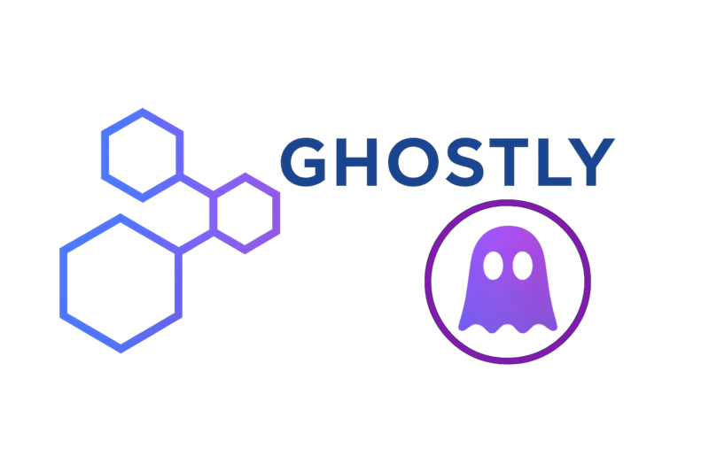

<p align="center">
    <picture align="center">
        
    </picture>
</p>

# Ghostly

[](https://github.com/openbiosim/ghostly/actions/workflows/devel.yaml)
[](https://anaconda.org/openbiosim/ghostly)
[](https://www.gnu.org/licenses/gpl-3.0)

Ghostly is a package to perform modification of ghost (dummy) atom bonded
terms for alchemical free energy calculations, using the approach described in
the paper "Dummy Atoms in Alchemical Free Energy Calculations", available
[here](https://pubs.acs.org/doi/10.1021/acs.jctc.0c01328). These modifications
were designed to solve two key issues:

1) To ensure that ghost atoms only give a multiplicative contribution to the
partition function, which will cancel when computing double free-energy
differences.

2) To avoid spurious coupling between the physical and ghost systems, which
can affect the equilibrium geometry of the physical system.

Ghostly is incorporated into the [SOMD2](https://github.com/openbiosim/somd2)
free-energy perturbation engine.

See the [examples](examples) directory for more details.

## Installation

### Conda package

Install `ghostly` directly from the `openbiosim` channel:

```
conda install -c conda-forge -c openbiosim ghostly
```

Or, for the development version:

```
conda install -c conda-forge -c openbiosim/label/dev ghostly
```

### Installing from source (standalone)

To install from source using [pixi](https://pixi.sh), which will
automatically create an environment with all required dependencies
(including pre-built [Sire](https://github.com/OpenBioSim/sire) and
[BioSimSpace](https://github.com/OpenBioSim/biosimspace)):

```
git clone https://github.com/openbiosim/ghostly
cd ghostly
pixi install
pixi shell
pip install -e .
```

### Installing from source (full OpenBioSim development)

If you are developing across the full OpenBioSim stack, first install
[Sire](https://github.com/OpenBioSim/sire) from source by following the
instructions [here](https://github.com/OpenBioSim/sire#installation), then
activate its pixi environment:

```
pixi shell --manifest-path /path/to/sire/pixi.toml -e dev
```

You may also need to install other packages from source, e.g.
[BioSimSpace](https://github.com/OpenBioSim/biosimspace):

```
pip install -e /path/to/biosimspace
```

Then install `ghostly` into the environment:

```
pip install -e .
```

### Testing

You should now have a `ghostly` executable in your path. To test, run:

```
ghostly --help
```

## Development

Pre-commit hooks are used to ensure consistent code formatting and linting.
To set up pre-commit in your development environment:

```
pixi shell -e dev
pre-commit install
```

This will run [ruff](https://docs.astral.sh/ruff/) formatting and linting
checks automatically on each commit. To run the checks manually against all
files:

```
pre-commit run --all-files
```

## Usage

Ghostly requires topology and coordinate files for the reference and perturbed molecules
as input, along with an optional `mapping` dictionary that specifies the mapping between
atoms in the end states. The molecular inputs can be in any valid file format supported
by [Sire](https://sire.openbiosim.org). The mapping should be a string representation
of a dictionary, where the keys are atom indices in the reference state and the values
are the corresponding atom indices in the perturbed state. This allows the mapping to
be generated programmatically by any suitable external tool.

```bash
ghostly --reference reference.* --perturbed.* --mapping '{0: 0, 1: 4, 2: 3, 3: 2, 4: 1}' --log-level debug
```

Alternatively, you can pass a stream file containing a perturbable [BioSimSpace](https://biosimspace.openbiosim.org)
system, which already contains the merged end states, using the `--system` option.

```bash
ghostly --system system.bss --log-level debug
```

> [!NOTE]
> The `--system` option takes precedence over the `--reference` and `--perturbed` options.

When finished, the program will output a [BioSimSpace](https://biosimspace.openbiosim.org)
stream file for the perturbable molecule, or AMBER or GROMACS files for the two end states.
The format can be specified using the the `--output-format` option. If you require input
for a free-energy perturbation simulation, e.g. a hybrid GROMACS toplogy file, the you can
use the stream file with [BioSimSpace](https://biosimspace.openbiosim.org) to generate the
required input files. Additionally, the program will output a JSON file summarising the
modifications that were made.

> [!NOTE]
> When a stream file is used as input, the `--mapping` option is ignored. and
> the output will always be a stream file, regardless of the `--output-format` option.

Please run `ghostly --help` for more details of other configuration options.
