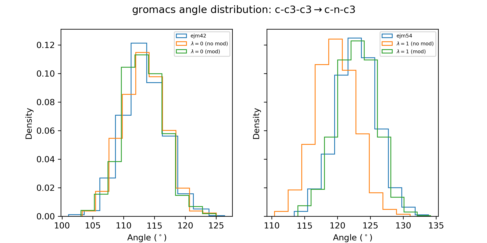

# Examples

This directory contains examples demonstrating the use of `ghostly` for
modification of bonded terms involving ghost atoms in alchemical free energy
perturbations. To create a conda environment with the required dependencies,
you can use the provided `environment.yml` file:

```bash
conda env create -f environment.yml
conda activate ghostly
```

## ejm42 &#8594; ejm54

### Set up

This example perturbation is taken from the TYK2 section of the Wang et al.
free-energy perturbation dataset. The perturbation involves an SP3 (tetrahedral)
carbon to to SP2 (trigonal planar) nitrogen hybridization change, which is
poorly modelled by traditional ghost atom handling schemes.

First, let's load the input ligands using [BioSimSpace](https://biosimspace.openbiosim.org):

```python
import BioSimSpace as BSS

ejm42 = BSS.IO.readMolecules("inputs/ejm42.sdf")[0]
ejm54 = BSS.IO.readMolecules("inputs/ejm54.sdf")[0]
```

Next we'll parameterise the ligands using GAFF:

```python
ejm42 = BSS.Parameters.gaff(ejm42).getMolecule()
ejm54 = BSS.Parameters.gaff(ejm54).getMolecule()
```

For later use, we'll save the parameterised ligands to stream files:

```python
BSS.Stream.save(ejm42, "ejm42")
BSS.Stream.save(ejm54, "ejm54")
```

In order to run the perturbation, we need to define a mapping
between the atoms in the two ligands. This can be done using
BioSimSpace's `matchAtoms` function:

```python
mapping = BSS.Align.matchAtoms(ejm42, ejm54)
```

Let's visualise the mapping:

```python
BSS.Align.viewMapping(ejm42, ejm54, mapping)
```


In particular, we are interested in the angle formed by atom indices
22, 24, and 27 in the left-hand ligand (ejm42). This angle is formed
by three carbon atoms. In the right-hand ligand (ejm54), where the
same angle is formed by indices 22, 24, and 26, the central carbon
has converted to a nitrogen atom, changing the preferred angle
from approximately 109.5 degrees to 120 degrees.

Next we need to *merge* the two ligands into a single perturbable
system. This can be done using BioSimSpace's `merge` function:

```python
ejm42_ejm54 = BSS.Align.merge(ejm42, ejm54, mapping).toSystem()
```

Finally, we can save the merged molecule to a stream file for use
with `ghostly`:

```python
BSS.Stream.save(ejm42_ejm54, "ejm42_ejm54")
```

### Ghost atom modifications

We can now use `ghostly` to apply appropriate modifications to bonded terms
involving ghost atoms. Here we will use the `ghostly` command-line interface,
but the same functionality is available via the Python API. So that we can
see what modifications are made, we will use the `debug` log-level option:

```bash
ghostly --system ejm42_ejm54.bss --log-level debug --output-prefix ejm42_ejm54_ghostly
```

When running the above command, you should see output similar to the following:

```
2025-09-22 15:38:45.753 | DEBUG    | ghostly._ghostly:modify:177 - Ghost atom bridges at lambda = 0
2025-09-22 15:38:45.754 | DEBUG    | ghostly._ghostly:modify:179 -   Bridge 0: 30
2025-09-22 15:38:45.754 | DEBUG    | ghostly._ghostly:modify:180 -   ghosts: [35,36,37]
2025-09-22 15:38:45.754 | DEBUG    | ghostly._ghostly:modify:183 -   physical: [27]
2025-09-22 15:38:45.754 | DEBUG    | ghostly._ghostly:modify:186 -   type: 1
2025-09-22 15:38:45.754 | DEBUG    | ghostly._ghostly:modify:189 - Ghost atom bridges at lambda = 1
2025-09-22 15:38:45.754 | DEBUG    | ghostly._ghostly:modify:191 -   Bridge 0: 24
2025-09-22 15:38:45.754 | DEBUG    | ghostly._ghostly:modify:192 -   ghosts: [25]
2025-09-22 15:38:45.754 | DEBUG    | ghostly._ghostly:modify:195 -   physical: [22,26,27]
2025-09-22 15:38:45.754 | DEBUG    | ghostly._ghostly:modify:198 -   type: 3
2025-09-22 15:38:45.754 | DEBUG    | ghostly._ghostly:_terminal:327 - Applying Boresch modifications to terminal ghost junction at λ = 0:
2025-09-22 15:38:45.756 | DEBUG    | ghostly._ghostly:_terminal:375 -   Removing dihedral: [29-27-30-35], 0.155556 cos(3 phi) + 0.155556
2025-09-22 15:38:45.756 | DEBUG    | ghostly._ghostly:_terminal:375 -   Removing dihedral: [29-27-30-36], 0.155556 cos(3 phi) + 0.155556
2025-09-22 15:38:45.756 | DEBUG    | ghostly._ghostly:_terminal:375 -   Removing dihedral: [29-27-30-37], 0.155556 cos(3 phi) + 0.155556
2025-09-22 15:38:45.756 | DEBUG    | ghostly._ghostly:_terminal:375 -   Removing dihedral: [28-27-30-35], 0.155556 cos(3 phi) + 0.155556
2025-09-22 15:38:45.756 | DEBUG    | ghostly._ghostly:_terminal:375 -   Removing dihedral: [28-27-30-36], 0.155556 cos(3 phi) + 0.155556
2025-09-22 15:38:45.756 | DEBUG    | ghostly._ghostly:_terminal:375 -   Removing dihedral: [28-27-30-37], 0.155556 cos(3 phi) + 0.155556
2025-09-22 15:38:45.757 | DEBUG    | ghostly._ghostly:_triple:666 - Applying Boresch modifications to triple ghost junction at λ = 1:
2025-09-22 15:38:45.757 | DEBUG    | ghostly._ghostly:_triple:787 -   Non-planar junction.
2025-09-22 15:38:45.758 | DEBUG    | ghostly._ghostly:_triple:835 -   Softening angle: [22-24-25], 46.9 [theta - 1.8984]^2 --> 0.05 [theta - 1.8984]^2
2025-09-22 15:38:45.758 | DEBUG    | ghostly._ghostly:_triple:835 -   Softening angle: [25-24-26], 39.4 [theta - 1.87763]^2 --> 0.05 [theta - 1.87763]^2
2025-09-22 15:38:45.758 | DEBUG    | ghostly._ghostly:_triple:835 -   Softening angle: [25-24-27], 46.3 [theta - 1.91637]^2 --> 0.05 [theta - 1.91637]^2
2025-09-22 15:38:45.760 | DEBUG    | ghostly._ghostly:_triple:864 -   Removing dihedral: [20-22-24-25], 0
2025-09-22 15:38:45.760 | DEBUG    | ghostly._ghostly:_triple:864 -   Removing dihedral: [25-24-27-28], 0.15 cos(3 phi) + 0.15
2025-09-22 15:38:45.760 | DEBUG    | ghostly._ghostly:_triple:864 -   Removing dihedral: [25-24-27-29], 0.15 cos(3 phi) + 0.15
2025-09-22 15:38:45.760 | DEBUG    | ghostly._ghostly:_triple:864 -   Removing dihedral: [25-24-27-30], 0.15 cos(3 phi) + 0.15
2025-09-22 15:38:45.762 | DEBUG    | ghostly._ghostly:_triple:864 -   Removing dihedral: [23-22-24-25], 0.08 cos(3 phi - 3.14159) + 0.8 cos(phi) + 0.88
2025-09-22 15:38:45.763 | DEBUG    | ghostly._ghostly:_triple:889 -   Optimising equilibrium values for softened angles.
2025-09-22 15:38:46.608 | DEBUG    | ghostly._ghostly:_triple:957 -   Optimising angle: [22-24-25], 0.05 [theta - 1.8984]^2 --> 5 [theta - 1.6594]^2 (std err: 0.004 radian)
2025-09-22 15:38:46.608 | DEBUG    | ghostly._ghostly:_triple:957 -   Optimising angle: [25-24-26], 0.05 [theta - 1.87763]^2 --> 5 [theta - 1.54919]^2 (std err: 0.003 radian)
2025-09-22 15:38:46.608 | DEBUG    | ghostly._ghostly:_triple:957 -   Optimising angle: [25-24-27], 0.05 [theta - 1.91637]^2 --> 5 [theta - 1.47607]^2 (std err: 0.000 radian)
```

The ouput specifies the bridge atoms that connect ghost atoms to the physical
system in each end state, along with the type of junction and information about
the specific modifications made. Please refer to the paper "Dummy Atoms in
Alchemical Free Energy Calculations", available
[here](https://pubs.acs.org/doi/10.1021/acs.jctc.0c01328) for technical details.

> [!NOTE]
> Softened angles for non-planar triple are automatically optimised using an
> internal [OpenMM](https://openmm.org) wrapper.

When complete, the modified system is saved to `ejm42_ejm54_ghostly.bss` stream file.

### Running the perturbation

In order to assess the impact of the ghost atom modifications, we will run
the ejm42 to ejm54 perturbation in vacuum both with and without ghost modifications
using three different simulation engines: [SOMD1](https://siremol.org/tutorials/somd/),
[SOMD2](https://github.com/OpenBioSim/somd2), and [GROMACS](http://www.gromacs.org).
By measuring angle distributions around the perturbing atom, we can see how the
modifications affect the equilibrium geometry of the physical system.

First, we will need some reference simulations of the unmodified ligands in vacuum,
which we can easily perform using [sire](https://sire.openbiosim.org). Here will
perform 1ns of dynamics saving frames every 1ps:

```python
import sire as sr

# Load the parameterised ligands.
ejm42 = sr.stream.load("ejm42.bss")
ejm54 = sr.stream.load("ejm54.bss")

# Create a dynamics object for ejm42.
d = ejm42.dynamics(
    timestep="2fs",
    constraint="none",
    integrator="langevin_middle",
    temperature="298K",
)

# Run 1ns of dynamics, saving frames every 1ps.
d.run("1ns", frame_frequency="1ps")

# Commit the changes.
ejm42 = d.commit()

# Save the topology and trajectory.
sr.save(ejm42, "ejm42.prm7")
sr.save(ejm42.trajectory(), "ejm42.dcd")

# Repeat for ejm54.

d = ejm54.dynamics(
    timestep="2fs",
    constraint="none",
    integrator="langevin_middle",
    temperature="298K",
)

d.run("1ns", frame_frequency="1ps")

ejm54 = d.commit()

sr.save(ejm54, "ejm54.prm7")
sr.save(ejm54.trajectory(), "ejm54.dcd")
```

A script is provided in the [scripts](scripts) directory to measure the angle
of interest from the resulting trajectories:

```bash
python scripts/measure_angle.py ejm42.prm7 ejm42.dcd 22 24 27 angles_ej42.txt
python scripts/measure_angle.py ejm54.prm7 ejm54.dcd 22 24 26 angles_ej54.txt
```

For `SOMD1` and `GROMACS`, we can use `BioSimSpace` to set up and run the perturbation.
Let's start with `SOMD1`.

```python
import BioSimSpace as BSS

# Load the modified and unmodified systems.
ejm42_ejm54 = BSS.Stream.load("ejm42_ejm54.bss")
ejm42_ejm54_ghostly = BSS.Stream.load("ejm42_ejm54_ghostly.bss")

# Create simulation protocols for the end-states.
protocol_0 = BSS.Protocol.FreeEnergyProduction(
    runtime="1ns",
    report_interval=500,
    restart_interval=500,
    lam=0.0,
)
protocol_1 = BSS.Protocol.FreeEnergyProduction(
    runtime="1ns",
    report_interval=500,
    restart_interval=500,
    lam=1.0,
)

# Run the unmodified perturbation.

# Lambda = 0
process = BSS.Process.Somd(
    system=ejm42_ejm54,
    protocol=protocol_0,
    no_dummy_modifications=True,
    work_dir="somd1/no_mod/lambda_0",
)
process.start()
process.wait()

# Lambda = 1
process = BSS.Process.Somd(
    system=ejm42_ejm54,
    protocol=protocol_1,
    no_dummy_modifications=True,
    work_dir="somd1/no_mod/lambda_1",
)
process.start()
process.wait()

# Run the modified perturbation.

# Lambda = 0
process = BSS.Process.Somd(
    system=ejm42_ejm54_ghostly,
    protocol=protocol_0,
    no_dummy_modifications=True,
    work_dir="somd1/mod/lambda_0",
)
process.start()
process.wait()

# Lambda = 1
process = BSS.Process.Somd(
    system=ejm42_ejm54_ghostly,
    protocol=protocol_1,
    no_dummy_modifications=True,
    work_dir="somd1/mod/lambda_1",
)
process.start()
process.wait()
```

> [!NOTE]
> The `no_dummy_modifications=True` flag is required to disable the automatic
> ghost atom handling in `SOMD1`, i.e. we want to use the terms from the
> stream file without additional modification.

Once the simulations are complete, we can measure the angle of interest
using the provided script:

```bash
python scripts/measure_angle.py somd1/no_mod/lambda_0/somd.prm7 somd1/no_mod/lambda_0/traj000000001.dcd 22 24 27 angles_somd1_no_mod_0.txt
python scripts/measure_angle.py somd1/no_mod/lambda_1/somd.prm7 somd1/no_mod/lambda_1/traj000000001.dcd 22 24 27 angles_somd1_no_mod_1.txt
python scripts/measure_angle.py somd1/mod/lambda_0/somd.prm7 somd1/mod/lambda_0/traj000000001.dcd 22 24 27 angles_somd1_mod_0.txt
python scripts/measure_angle.py somd1/mod/lambda_1/somd.prm7 somd1/mod/lambda_1/traj000000001.dcd 22 24 27 angles_somd1_mod_1.txt
```

> [!NOTE]
> The merged molecule uses the reference state (lambda = 0) for atom indexing,
> so we use indices 22, 24, and 27 for both end states when measuring the angle.

Angle distributions can be measured and visualised using another script:

```bash
python scripts/plot.py angles_ejm42.txt angles_ejm54.txt angles_somd1_no_mod_0.txt angles_somd1_no_mod_1.txt angles_somd1_mod_0.txt angles_somd1_mod_1.txt somd1
```

This will produce a plot called `angles_somd1.png` in the current directory, which
should look something like this:


Here we can see that while all angle distributions match in the lambda=0 state,
the unmodified perturbation (orange) disagrees in the lambda=1 state, where the
angle distribution is shifted towards lower values. With the ghost modifications
applied (green), the angle distribution is in much better agreement with the
reference simulation (blue).

Running the perturbation with `GROMACS` is very similar, although we also need to
minimise the end-states since this is not done automatically:

```python
import BioSimSpace as BSS

# Load the modified and unmodified systems.
ejm42_ejm54 = BSS.Stream.load("ejm42_ejm54.bss")
ejm42_ejm54_ghostly = BSS.Stream.load("ejm42_ejm54_ghostly.bss")

# Create simulation protocols for the end-states.
protocol_min_0 = BSS.Protocol.FreeEnergyMinimisation(lam=0.0)
protocol_min_1 = BSS.Protocol.FreeEnergyMinimisation(lam=1.0)
protocol_0 = BSS.Protocol.FreeEnergyProduction(
    runtime="1ns",
    report_interval=500,
    restart_interval=500,
    lam=0.0,
)
protocol_1 = BSS.Protocol.FreeEnergyProduction(
    runtime="1ns",
    report_interval=500,
    restart_interval=500,
    lam=1.0,
)

# Run the unmodified perturbation.

# Lambda = 0

# Minimise.
process = BSS.Process.Gromacs(
    system=ejm42_ejm54,
    protocol=protocol_min_0,
)
process.start()
process.wait()
ejm42_ejm54_min_0 = process.getSystem()

# Dynamics.
process = BSS.Process.Gromacs(
    system=ejm42_ejm54_min_0,
    protocol=protocol_0,
    work_dir="gromacs/no_mod/lambda_0",
)
process.start()
process.wait()

# Lambda = 1

# Minimise.
process = BSS.Process.Gromacs(
    system=ejm42_ejm54,
    protocol=protocol_min_1,
)
process.start()
process.wait()
ejm42_ejm54_min_1 = process.getSystem()

# Dynamics.
process = BSS.Process.Gromacs(
    system=ejm42_ejm54_min_1,
    protocol=protocol_1,
    work_dir="gromacs/no_mod/lambda_1",
)
process.start()
process.wait()

# Run the modified perturbation.

# Lambda = 0

# Minimise.
process = BSS.Process.Gromacs(
    system=ejm42_ejm54_ghostly,
    protocol=protocol_min_0,
)
process.start()
process.wait()
ejm42_ejm54_ghostly_min_0 = process.getSystem()

# Dynamics.
process = BSS.Process.Gromacs(
    system=ejm42_ejm54_ghostly_min_0,
    protocol=protocol_0,
    work_dir="gromacs/mod/lambda_0",
)
process.start()
process.wait()

# Lambda = 1

# Minimise.
process = BSS.Process.Gromacs(
    system=ejm42_ejm54_ghostly,
    protocol=protocol_min_1,
)
process.start()
process.wait()
ejm42_ejm54_ghostly_min_1 = process.getSystem()

# Dynamics.
process = BSS.Process.Gromacs(
    system=ejm42_ejm54_ghostly_min_1,
    protocol=protocol_1,
    work_dir="gromacs/mod/lambda_1",
)
process.start()
process.wait()
```

Again, we can measure the angle of interest using the provided script:

```bash
python scripts/measure_angle.py gromacs/no_mod/lambda_0/gromacs.top gromacs/no_mod/lambda_0/gromacs.xtc 22 24 27 angles_gromacs_no_mod_0.txt
python scripts/measure_angle.py gromacs/no_mod/lambda_1/gromacs.top gromacs/no_mod/lambda_1/gromacs.xtc 22 24 27 angles_gromacs_no_mod_1.txt
python scripts/measure_angle.py gromacs/mod/lambda_0/gromacs.top gromacs/mod/lambda_0/gromacs.xtc 22 24 27 angles_gromacs_mod_0.txt
python scripts/measure_angle.py gromacs/mod/lambda_1/gromacs.top gromacs/mod/lambda_1/gromacs.xtc 22 24 27 angles_gromacs_mod_1.txt
```

As before, angle distributions can be measured and visualised using another script:

```bash
python scripts/plot.py angles_ejm42.txt angles_ejm54.txt angles_gromacs_no_mod_0.txt angles_gromacs_no_mod_1.txt angles_gromacs_mod_0.txt angles_gromacs_mod_1.txt gromacs
```

This will produce a plot called `angles_gromacs.png` in the current directory, which
should look something like this:



Here we see a similar trend to the `SOMD1` results, with the unmodified perturbation
(orange) disagreeing in the lambda=1 state, while the modified perturbation (green)
is in much better agreement with the reference simulation (blue).

Finally, we can run the perturbation with `SOMD2`, using its command-line
interface. Firstly, we'll run the unmodified perturbation:

```bash
somd2 ejm42_ejm54_vac.bss --runtime 1ns --frame-frequency 1ps --h-mass-factor 1 --timestep 2fs --lambda-values 0.0 1.0 --no-ghost-modifications --output-directory somd2/no_mod
```

> [!NOTE]
> The `--no-ghost-modifications` flag is required to disable the automatic
> ghost atom handling in `SOMD2`, i.e. we want to use the terms from the
> stream file without additional modification.

And then the modified perturbation:

```bash
somd2 ejm42_ejm54_ghostly.bss --runtime 1ns --frame-frequency 1ps --h-mass-factor 1 --timestep 2fs --lambda-values 0.0 1.0 --output-directory somd2/mod
```

Once again, we can measure the angle of interest using the provided script:

```bash
python scripts/measure_angle.py somd2/no_mod/system0.prm7 somd2/no_mod/traj_0.00000.dcd 22 24 27 angles_somd2_no_mod_0.txt
python scripts/measure_angle.py somd2/no_mod/system1.prm7 somd2/no_mod/traj_1.00000.dcd 22 24 27 angles_somd2_no_mod_1.txt
python scripts/measure_angle.py somd2/mod/system0.prm7 somd2/mod/traj_0.00000.dcd 22 24 27 angles_somd2_mod_0.txt
python scripts/measure_angle.py somd2/mod/system1.prm7 somd2/mod/traj_1.00000.dcd 22 24 27 angles_somd2_mod_1.txt
```

And visualise the results:

```bash
python scripts/plot.py angles_ejm42.txt angles_ejm54.txt angles_somd2_no_mod_0.txt angles_somd2_no_mod_1.txt angles_somd2_mod_0.txt angles_somd2_mod_1.txt somd2
```

This will produce a plot called `angles_somd2.png` in the current directory, which
should look something like this:


Here we see the same trend as before, with the unmodified perturbation
(orange) disagreeing in the lambda=1 state, while the modified perturbation
(green) is in much better agreement with the reference simulation (blue).
